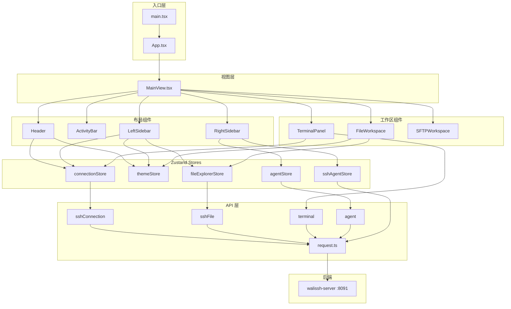

# WaLiSSH Client 前端架构指南

> 面向前端初学者的项目说明文档。帮助你快速理解这个项目「用了什么技术」「页面长什么样」「数据存在哪里」。

---

## 1. 项目是什么？

**WaLiSSH Client** 是一个 **SSH 智能终端桌面应用**，界面风格类似 VS Code：

- 连接远程 Linux 服务器，在网页/桌面里操作终端
- 浏览、编辑远程文件
- 通过 SFTP 上传/下载文件
- 右侧有 **AI 对话面板**，可以绑定当前 SSH 连接，让 AI 帮你执行命令、分析日志

> 重要：SSH 和 AI 的实际操作都在 **后端服务 walissh-server** 上执行，客户端只负责 UI 和 API 调用。这是企业里常见的「前后端分离 + 服务端统一管控」做法。

---

## 2. 技术栈一览

| 类别 | 技术 | 作用 |
|------|------|------|
| 框架 | **React 19** | 构建 UI 界面 |
| 语言 | **TypeScript** | 给 JavaScript 加类型，减少 bug |
| 构建工具 | **Vite 7** | 开发热更新、打包 |
| 桌面壳 | **Tauri 2** | 把 Web 应用打包成桌面程序（可选） |
| 样式 | **Tailwind CSS 4** | 原子化 CSS，快速写布局 |
| 状态管理 | **Zustand 5** | 轻量全局状态，比 Redux 简单 |
| 代码编辑器 | **Monaco Editor** | VS Code 同款编辑器，用于编辑远程文件 |
| 终端模拟 | **xterm.js** | 在浏览器里模拟真实终端 |
| HTTP | **fetch** | 封装在 `src/api/request.ts`，调用后端 API |

**没有使用**：React Router（只有一个主页面）、Redux、Ant Design 等 UI 库。

---

## 3. 目录结构

```
walissh-client/
├── src/                          # 前端源码（重点看这里）
│   ├── main.tsx                  # 程序入口：挂载 React 到 #root
│   ├── App.tsx                   # 根组件：启动心跳、渲染 MainView
│   ├── index.css                 # 全局样式
│   │
│   ├── views/                    # 页面级组件（目前只有 1 个）
│   │   └── MainView.tsx          # ★ 主界面：整体布局 + 面板切换
│   │
│   ├── components/               # 可复用 UI 组件
│   │   ├── Header.tsx            # 顶部标题栏
│   │   ├── ActivityBar.tsx       # 最左侧图标栏（类似 VS Code）
│   │   ├── LeftSidebar.tsx       # 左侧面板（服务器列表 / 文件树）
│   │   ├── RightSidebar.tsx      # 右侧 AI 对话面板
│   │   ├── TerminalPanel.tsx     # SSH 终端（xterm.js）
│   │   ├── FileWorkspace.tsx     # 文件编辑区（Monaco）
│   │   ├── SFTPWorkspace.tsx     # SFTP 文件传输
│   │   ├── SSHConnectionModal.tsx# 添加/编辑 SSH 连接弹窗
│   │   ├── Settings.tsx          # 设置弹窗
│   │   ├── CodeEditor.tsx        # 独立编辑器示例（暂未接入主流程）
│   │   └── CommandData/          # 终端命令辅助数据
│   │
│   ├── stores/                   # ★ 全局状态（Zustand）
│   │   ├── connectionStore.ts    # SSH 连接列表与连接状态
│   │   ├── themeStore.ts         # 主题颜色
│   │   ├── fileExplorerStore.ts  # 文件树 + 打开的文件标签
│   │   ├── agentStore.ts         # AI 对话会话
│   │   └── sshAgentStore.ts      # AI 与 SSH 终端的绑定关系
│   │
│   ├── api/                      # 与后端通信的接口层
│   │   ├── request.ts            # 通用 HTTP 封装
│   │   ├── sshConnection.ts      # SSH 连接 CRUD
│   │   ├── terminal.ts           # 终端开/关/读写
│   │   ├── sshFile.ts            # 远程文件读写
│   │   ├── agent.ts              # AI 智能体
│   │   └── sshAgent.ts           # AI ↔ 终端绑定
│   │
│   └── types/                    # TypeScript 类型定义
│       └── index.ts
│
├── src-tauri/                    # Tauri 桌面端配置（Rust）
├── docs/                         # 文档
├── vite.config.ts                # Vite 配置（含 API 代理）
└── package.json                  # 依赖与脚本
```

---

## 4. 应用启动流程

理解「代码从哪开始跑」：

```
index.html
    ↓
main.tsx          → 创建 React 根节点，配置 Monaco 编辑器
    ↓
App.tsx           → 启动 SSH 心跳检测；关闭窗口时断开连接
    ↓
MainView.tsx      → 渲染完整 IDE 布局
```

**`App.tsx` 做了两件全局事：**

1. 应用启动时，把所有 SSH 连接状态重置为「未连接」，然后每 10 秒心跳检测一次
2. 用户关闭页面/窗口时，自动断开所有已连接的 SSH

**`MainView.tsx` 是 UI 的「总指挥」**，负责：

- 左侧显示/隐藏、宽度拖拽
- 右侧 AI 面板显示/隐藏、宽度拖拽
- 根据 ActivityBar 切换中间工作区（终端 / 文件 / SFTP）
- 文件标签页、分屏布局（标签 / 上下分屏 / 左右分屏）

---

## 5. 页面布局（一图看懂）

整体是 **经典 IDE 三栏布局**，灵感来自 VS Code：

```
┌─────────────────────────────────────────────────────────────────────────┐
│  Header（顶部栏）                                                         │
│  [折叠侧栏] [添加SSH] 当前连接信息          [终端开关] [AI对话开关]          │
├────┬──────────────┬─────────────────────────────────────┬───────────────┤
│    │              │                                     │               │
│ A  │  LeftSidebar │         中间工作区                   │  RightSidebar │
│ c  │              │                                     │               │
│ t  │  根据 Tab    │  servers  → TerminalPanel（终端）    │  AI 对话      │
│ i  │  显示不同    │  files    → FileWorkspace（编辑器）  │  消息列表     │
│ v  │  内容：      │           + TerminalPanel（可分屏）   │  输入框       │
│ i  │              │  sftp     → SFTPWorkspace（传输）   │               │
│ t  │  · SSH列表   │  extensions → 占位（开发中）          │               │
│ y  │  · 文件树    │                                     │               │
│    │  · SFTP树    │                                     │               │
│ B  │              │                                     │               │
│ a  │              │                                     │               │
│ r  │              │                                     │               │
│    │              │                                     │               │
│ ←可拖拽宽度→      │                                     │  ←可拖拽宽度→   │
└────┴──────────────┴─────────────────────────────────────┴───────────────┘

弹窗层（覆盖在上面）：
  · SSHConnectionModal — 新建/编辑 SSH 连接
  · Settings           — 主题、服务端地址等设置
```

### ActivityBar 四个 Tab

| Tab ID | 中文名 | 左侧面板内容 | 中间工作区 |
|--------|--------|--------------|------------|
| `servers` | SSH 服务器 | SSH 连接列表 | 全屏终端 |
| `files` | 文件目录 | 远程文件树 | 文件编辑器 + 可选终端分屏 |
| `sftp` | SFTP | 远程目录树 | 本地↔远程文件传输 |
| `extensions` | 扩展 | — | 占位（开发中） |

---

## 6. 组件职责详解

### 6.1 布局类组件

| 组件 | 文件 | 职责 |
|------|------|------|
| **Header** | `Header.tsx` | 顶部工具栏：折叠侧栏、添加 SSH、显示当前连接、切换终端/AI 面板 |
| **ActivityBar** | `ActivityBar.tsx` | 最窄的图标栏，切换 4 个功能 Tab，底部有设置按钮 |
| **LeftSidebar** | `LeftSidebar.tsx` | 左侧面板主体，根据 `activeTab` 渲染不同内容（连接列表或文件树） |
| **RightSidebar** | `RightSidebar.tsx` | AI 聊天界面：选智能体、发消息、显示 ReAct 步骤、绑定 SSH |

### 6.2 功能类组件

| 组件 | 文件 | 职责 |
|------|------|------|
| **TerminalPanel** | `TerminalPanel.tsx` | 用 xterm.js 渲染终端；轮询后端读取输出；支持命令辅助侧边栏；选中文字可发送到 AI |
| **FileWorkspace** | `FileWorkspace.tsx` | Monaco 编辑器展示/编辑远程文件；保存、sudo 保存、加载大文件分片 |
| **SFTPWorkspace** | `SFTPWorkspace.tsx` | 本地文件夹与远程目录之间的上传 |
| **SSHConnectionModal** | `SSHConnectionModal.tsx` | 表单：主机、端口、用户名、密码/私钥 |
| **Settings** | `Settings.tsx` | 服务端地址、主题切换、终端字体等 |

### 6.3 组件之间的数据传递方式

这个项目主要用两种方式传数据：

1. **Props 向下传递**（父 → 子）  
   例：`MainView` 把 `activeTab` 传给 `LeftSidebar`，把 `onToggleSidebar` 传给 `Header`

2. **Zustand Store 全局共享**（任意组件都能读/写）  
   例：`TerminalPanel` 和 `Header` 都通过 `useConnectionStore()` 读取当前 SSH 连接

```
┌──────────────┐     props      ┌──────────────┐
│  MainView    │ ────────────→  │ LeftSidebar  │
│ (本地 state) │                └──────┬───────┘
└──────┬───────┘                       │
       │                               │ useConnectionStore()
       │                               │ useFileExplorerStore()
       ▼                               ▼
┌──────────────┐                ┌──────────────┐
│ TerminalPanel│ ←─────────────→│ connectionStore │
└──────────────┘   同一 store    │ fileExplorerStore│
                                 └──────────────┘
```

---

## 7. 状态管理（Zustand Store）

> **Zustand 是什么？**  
> 一个超轻量的全局状态库。每个 store 就是一个「全局变量 + 修改方法」，任何组件调用 `useXxxStore()` 就能订阅变化。

### 7.1 `themeStore` — 主题

**文件：** `src/stores/themeStore.ts`

| 状态 | 说明 |
|------|------|
| `currentTheme` | 当前主题名：`dark` / `light` / `midnight` / `forest` |
| `colors` | 当前主题的颜色对象（背景、文字、边框、强调色等） |

| 方法 | 说明 |
|------|------|
| `setTheme(name)` | 切换主题，并持久化到 `localStorage` |

**使用场景：** 几乎所有组件都通过 `colors.xxx` 设置内联样式，实现统一换肤。

---

### 7.2 `connectionStore` — SSH 连接

**文件：** `src/stores/connectionStore.ts`

| 状态 | 说明 |
|------|------|
| `connections` | SSH 连接列表 |
| `currentConnectionId` | 当前选中的连接 ID |
| `serverStatus` | 后端服务是否可达 |
| `serverUrl` | 后端地址（默认 `http://localhost:8091`） |
| `loading` / `error` | 加载中与错误信息 |

| 方法 | 说明 |
|------|------|
| `fetchConnections()` | 从后端拉取连接列表 |
| `createConnection()` / `updateConnection()` / `removeConnection()` | 增删改连接 |
| `connect(id)` / `disconnect(id)` | 建立/断开 SSH |
| `selectConnection(id)` | 选中某个连接 |
| `setServerUrl(url)` | 修改后端地址 |
| `startHeartbeat()` / `stopHeartbeat()` | 每 10 秒检查连接是否还活着 |

**使用场景：** `LeftSidebar`（连接列表）、`Header`（显示当前连接）、`TerminalPanel`（终端绑定连接）

---

### 7.3 `fileExplorerStore` — 文件浏览与编辑

**文件：** `src/stores/fileExplorerStore.ts`

| 状态 | 说明 |
|------|------|
| `activeConnectionId` | 文件树当前对应的 SSH 连接 |
| `childrenByConnection` | 各连接下各目录的文件列表（树形数据） |
| `expandedByConnection` | 哪些目录已展开 |
| `currentPathByConnection` | 各连接当前所在路径 |
| `openTabs` | 已打开的文件标签列表 |
| `activeTabKey` | 当前激活的文件标签 |

| 方法 | 说明 |
|------|------|
| `navigateToPath()` | 进入某个目录 |
| `toggleDirectory()` | 展开/折叠目录 |
| `openFile()` | 打开文件（自动创建标签） |
| `updateFileContent()` | 编辑文件内容（标记为已修改） |
| `saveFile()` | 保存到远程服务器 |
| `closeTab()` / `closeAllTabs()` 等 | 标签页管理 |

**使用场景：** `LeftSidebar`（文件树）、`MainView`（文件标签栏）、`FileWorkspace`（编辑器）

---

### 7.4 `agentStore` — AI 对话

**文件：** `src/stores/agentStore.ts`

| 状态 | 说明 |
|------|------|
| `agents` | 可用的 AI 智能体列表 |
| `currentAgentId` | 当前选中的智能体 |
| `sessions` | 对话会话 Map（含消息历史） |
| `currentSessionId` | 当前会话 ID |
| `inputText` | 输入框文字 |
| `isLoading` | 是否正在等待 AI 回复 |

| 方法 | 说明 |
|------|------|
| `fetchAgents()` | 拉取智能体列表 |
| `createServerSession()` / `newConversation()` | 创建新对话 |
| `addMessage()` / `updateMessage()` | 添加/流式更新消息 |
| `updateMessageSteps()` | 更新 ReAct 推理步骤 |

**使用场景：** `RightSidebar`（AI 聊天主界面）

---

### 7.5 `sshAgentStore` — AI 与 SSH 终端绑定

**文件：** `src/stores/sshAgentStore.ts`

| 状态 | 说明 |
|------|------|
| `activeBinding` | 当前 AI 会话绑定的 SSH 终端信息 |
| `bindings` | 所有绑定记录 |
| `inputTags` | 输入框里的「标签」（如终端选中文字、文件片段） |
| `showConnectionSelector` | 是否显示连接选择器 |

| 方法 | 说明 |
|------|------|
| `bindTerminal()` / `unbindTerminal()` | 绑定/解绑终端到 AI 会话 |
| `addInputTag()` / `removeInputTag()` | 管理输入框上下文标签 |
| `formatServerContext()` | 把服务器信息格式化为 AI 上下文 |

**使用场景：** `RightSidebar`、`TerminalPanel`（选中终端文字发送到 AI）、`LeftSidebar`

---

### 7.6 状态 vs 本地 state：怎么区分？

| 类型 | 存在哪 | 典型例子 |
|------|--------|----------|
| **全局状态（Store）** | Zustand | SSH 连接列表、打开的文件、AI 消息 |
| **本地 state（useState）** | 单个组件内 | 弹窗开/关、拖拽中、侧边栏宽度 |

**经验法则：** 如果多个不相关的组件都需要同一份数据 → 放 Store；如果只在一个组件内用 → 用 `useState`。

---

## 8. API 层与数据流

所有后端请求统一走 `src/api/request.ts`：

```
组件 / Store
    ↓ 调用
api/sshConnection.ts、api/terminal.ts 等
    ↓ 调用
api/request.ts（fetch 封装）
    ↓
后端 walissh-server（默认 localhost:8091）
```

**开发模式下的代理：**  
`vite.config.ts` 把 `/api` 请求代理到 `http://localhost:8091`，所以前端代码里路径写 `/api/v1/...` 即可。

**响应格式统一为：**

```typescript
{
  code: "0000",   // "0000" 表示成功
  info: "提示信息",
  data: { ... }   // 实际数据
}
```

### 典型数据流示例：打开远程文件

```
1. 用户在 LeftSidebar 点击文件
2. LeftSidebar 调用 fileExplorerStore.openFile(connectionId, path, name)
3. store 调用 api/sshFile.getFileContent()
4. 后端返回文件内容
5. store 更新 openTabs，MainView 显示新标签，FileWorkspace 渲染 Monaco 编辑器
```

### 典型数据流示例：SSH 终端

```
1. 用户选中连接并点击「连接」
2. connectionStore.connect(id) → api/sshConnection.connect()
3. TerminalPanel 检测到连接状态变化
4. 调用 api/terminal.openTerminal() 创建终端会话
5. 每 50ms 轮询 api/terminal.readOutput() 把输出写到 xterm
6. 用户按键 → api/terminal.writeInput() 发送到后端
```

---

## 9. 类型定义

**文件：** `src/types/index.ts`

| 类型 | 说明 |
|------|------|
| `SSHConnection` | SSH 连接信息（id、host、port、username、status 等） |
| `ConnectionStatus` | 连接状态枚举：未连接(0)、已连接(1)、连接中(2)、失败(3) |
| `AgentMessage` | AI 消息（role、content、ReAct steps） |
| `AgentSession` | AI 会话 |
| `ServerStatus` | 后端服务状态 |

---

## 10. 前端小白必读概念

### React 组件

一个 `.tsx` 文件导出一个函数，函数返回 JSX（看起来像 HTML 的语法）：

```tsx
export function Header({ onToggleSidebar }: HeaderProps) {
  const { colors } = useThemeStore()  // 读全局状态
  return <div style={{ color: colors.text }}>...</div>
}
```

### Hooks 常用清单

| Hook | 作用 | 本项目中的例子 |
|------|------|----------------|
| `useState` | 组件内局部状态 | `MainView` 里的 `sidebarVisible` |
| `useEffect` | 副作用（请求、订阅、DOM 操作） | `App` 启动心跳 |
| `useCallback` | 缓存函数，避免重复创建 | 拖拽 resize 处理器 |
| `useRef` | 保存 DOM 引用或不触发重渲染的值 | 终端容器、滚动容器 |
| `useMemo` | 缓存计算结果 | `FileWorkspace` 里找当前激活 tab |

### Tailwind CSS

类名直接写在 `className` 里，例如：

- `flex` → 弹性布局
- `h-screen` → 高度 100vh
- `overflow-hidden` → 隐藏溢出

项目同时也大量用 **内联 style**（因为主题颜色来自 store，是动态的）。

---

## 11. 本地开发

**前置条件：** 先启动后端 `walissh-server`（默认端口 8091）

```bash
# 安装依赖
npm install

# 启动开发服务器（浏览器访问 http://localhost:5173）
npm run dev

# 打包桌面应用（需要 Rust 环境）
npm run tauri dev
```

Windows 也可使用：`docs/dev-ops/start-dev.bat`

---

## 12. 阅读代码的推荐顺序

如果你是第一次看这个项目，建议按这个顺序：

1. `src/main.tsx` → `src/App.tsx` — 理解入口
2. `src/views/MainView.tsx` — 理解整体布局（最重要）
3. `src/stores/themeStore.ts` — 最简单的 store，入门 Zustand
4. `src/stores/connectionStore.ts` — 理解业务核心
5. `src/components/Header.tsx` + `ActivityBar.tsx` — 小组件练手
6. `src/components/LeftSidebar.tsx` — 较复杂，含文件树逻辑
7. `src/components/TerminalPanel.tsx` — 终端 + 轮询机制
8. `src/components/RightSidebar.tsx` — AI 对话 + 流式消息
9. `src/api/request.ts` — HTTP 封装

---

## 13. 架构关系总图



---

*文档生成于项目源码分析，如有代码变更请以实际源码为准。*
